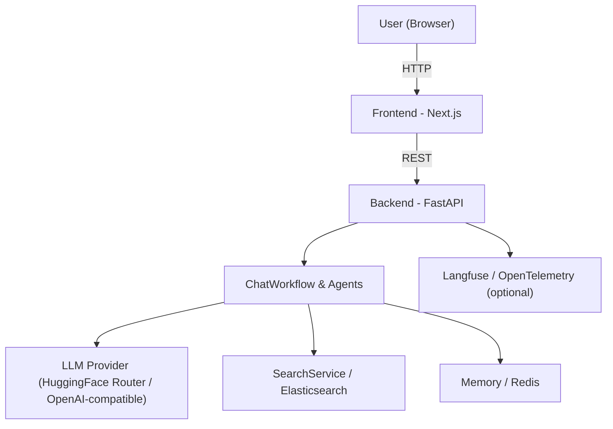
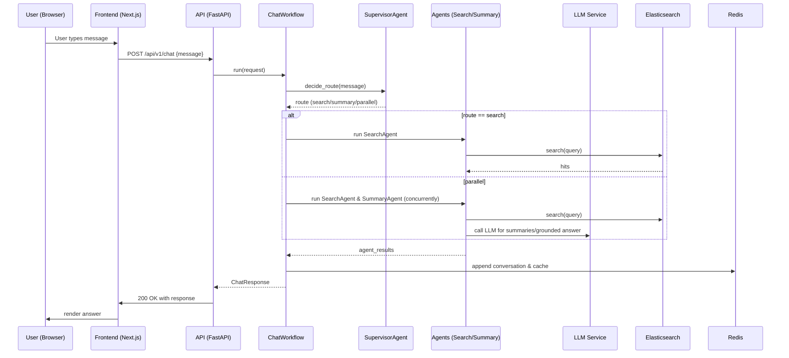
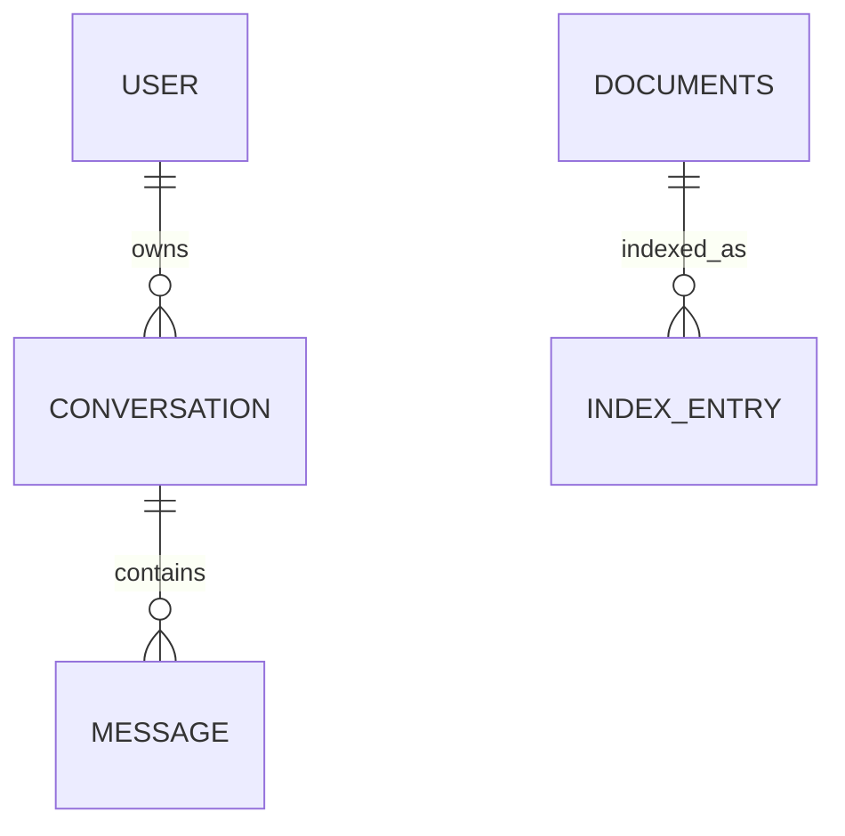

# AgenticAI

- Project: AgenticAI
- One-line summary: Starter multi-agent RAG backend and Next.js frontend integrating Redis memory, Elasticsearch retrieval, HuggingFace Router (OpenAI-compatible), and optional Langfuse observability.

## Project Overview

AgenticAI is a reference starter project that demonstrates a production-oriented architecture for building multi-agent, retrieval-augmented generation (RAG) systems. The repository contains:

- A Python FastAPI backend (under `backend/app/`) implementing agent orchestration, ingestion, retrieval, LLM integration, memory (Redis), search (Elasticsearch), observability (Langfuse + OpenTelemetry), and middleware.
- A minimal Next.js frontend (under `frontend/app/`) serving a simple UI to interact with the chat API.

This README documents the codebase, architecture, configuration, deployment, and developer guidance to extend the project for production usage.

## Business Problem Being Solved

Many teams want a repeatable scaffold for building RAG-enabled assistants that:

- Route user queries to the right sub-system (search, summarization, or parallel processing)
- Ingest diverse data formats (CSV, PDF) into a searchable index
- Use memory to provide conversational context
- Provide observability into model calls and traces
- Be easily extended with new agents, retrievers, or LLM providers

Key objectives:

- Provide a clean separation of concerns (ingest, search, memory, agents, orchestration)
- Offer production-ready patterns for logging, tracing, and error handling
- Keep the codebase compact and easy to extend

---

## Features

- Core:
  - Chat workflow with supervisor routing and agent orchestration
  - Redis-based conversational memory with in-memory fallback
  - Elasticsearch-backed retrieval and bulk indexing
  - HuggingFace Router / OpenAI-compatible client for LLM calls (`backend/app/services/llm_service.py`)
  - File ingestion for CSV and PDF (`backend/app/data_ingest/`)

- Agents & Workflows:
  - `SupervisorAgent` — decides route (greeting/search/summary/parallel) and supports LLM-based and keyword-based routing ([backend/app/agents/supervisor_agent.py](backend/app/agents/supervisor_agent.py#L1))
  - `SearchAgent`, `SummaryAgent`, `SupervisorAgent` and `ChatWorkflow` ([backend/app/workflows/chat_workflow.py](backend/app/workflows/chat_workflow.py#L1))

- Observability & Logging:
  - Structured logging with JSON/console options and contextual log enrichment ([backend/app/logging_config.py](backend/app/logging_config.py#L1))
  - Optional Langfuse instrumentation and OpenTelemetry exporter integration (config via environment variables; see `LANGFUSE_*` settings)

- Security / Auth:
  - Simple authentication using Redis to persist user accounts and JWT tokens via `TokenService` and `AuthService` ([backend/app/routers/auth_router.py](backend/app/routers/auth_router.py#L1))

- DevOps / Packaging:
  - `requirements.txt` for backend Python dependencies
  - `podman-compose.yml` prepared for container orchestration

---

## Architecture Overview

High-level components:

- Frontend (Next.js) - simple UI and page routing ([frontend/app/page.tsx](frontend/app/page.tsx#L1))
- Backend (FastAPI) - API, agents, workflows, ingestion, services
- Redis - ephemeral/chat memory, simple KV store for users
- Elasticsearch - vector/keyword search index for ingested documents
- Langfuse (optional) - tracing / observability

Mermaid - System architecture:



Frontend architecture
- Minimal Next.js app in `frontend/` serving static UI and calling backend APIs.

Backend architecture
- FastAPI app entrypoint: [backend/app/main.py](backend/app/main.py#L1) — registers routers and middleware.
- Routers: [backend/app/routers/](backend/app/routers/) — `auth`, `health`, `ingest`, `chat`.
- Services: [backend/app/services/] — LLM (HuggingFace Router), Search (Elasticsearch), Auth and Token services.
- Memory: `RedisMemoryService` ([backend/app/memory/redis_memory.py](backend/app/memory/redis_memory.py#L1)) with in-memory fallback for dev.
- Ingest: CSV and PDF ingestion pipelines under `backend/app/data_ingest/`.

Agent architecture
- Agents encapsulate discrete behaviors. `ChatWorkflow` orchestrates agents, and `SupervisorAgent` decides routing. Agents are instrumented with the optional Langfuse `@observe` decorator.

Retrieval architecture
- Ingested documents are indexed into Elasticsearch via `SearchService.bulk_index_documents` and searched via `SearchService.search` (multi_match query across `title`, `snippet`, `category`).

Data Flow (brief)
- Ingest -> CSV/PDF parsing -> documents -> bulk index to Elasticsearch
- Chat request -> ChatWorkflow -> Supervisor decides route -> Agents run (search/summary/LLM) -> final answer returned and appended to memory

---

## Tech Stack

| Layer | Language / Framework | Library / Key Packages | Purpose |
|---|---|---|---|
| Backend | Python 3.9 | FastAPI, pydantic | HTTP API, models |
| LLM Client | Python | openai (OpenAI client used with HuggingFace Router base_url) | LLM calls |
| Search | Python | elasticsearch (Elasticsearch Python client) | Document storage & retrieval |
| Memory | Python | redis | Conversational and KV storage |
| Observability | Python | langfuse, opentelemetry | Tracing & spans |
| Frontend | TypeScript | Next.js | UI |

---

## Project Structure

Top-level tree (major directories/files):

```
AgenticAI/
├─ backend/
│  ├─ app/
│  │  ├─ agents/                # Agents: supervisor, search, summary
│  │  ├─ config/                # Settings
│  │  ├─ data_ingest/           # CSV/PDF ingestion pipelines
│  │  ├─ middleware/            # Logging, rate-limiting, headers
│  │  ├─ memory/                # Redis memory service
│  │  ├─ models/                # Pydantic models
│  │  ├─ prompts/               # LLMPrompts templates
│  │  ├─ routers/               # FastAPI routers (auth, ingest, chat, health)
│  │  ├─ services/              # LLM, search, auth, token services
│  │  ├─ state/                 # GraphState dataclass
│  │  ├─ workflows/             # ChatWorkflow orchestrator
│  │  ├─ logging_config.py      # Logging & formatting
│  │  └─ main.py                # FastAPI app entrypoint
│  ├─ requirements.txt
  └─ .env

├─ frontend/
│  ├─ app/                     # Next.js app (layout.tsx, page.tsx)
│  └─ package.json

├─ podman-compose.yml
```

Key files and purpose:

- `backend/app/main.py` — application startup, router registration, middleware.
- `backend/app/routers/chat_router.py` — chat endpoints: `POST /api/v1/chat`, `GET/DELETE /api/v1/conversations/{id}/context`.
- `backend/app/routers/ingest_router.py` — ingest endpoints: `POST /api/v1/ingest/upload`, `POST /api/v1/ingest/batch`, `POST /api/v1/ingest/sample-data`.
- `backend/app/routers/auth_router.py` — auth endpoints: `POST /api/v1/auth/register`, `POST /api/v1/auth/login`.
- `backend/app/services/llm_service.py` — LLM client wrapper and model selection (HuggingFace Router / OpenAI-compatible usage).
- `backend/app/services/search_service.py` — Elasticsearch client, index creation and search logic.
- `backend/app/data_ingest/` — `csv_ingest.py`, `pdf_ingest.py`, and `file_ingest.py` for file parsing and directory scanning.

---

## System Workflow

Sequence for a typical user chat request:



---

## Agent Architecture (detailed)

The repository implements a light-weight multi-agent pattern.

- `SupervisorAgent` ([backend/app/agents/supervisor_agent.py](backend/app/agents/supervisor_agent.py#L1))
  - Purpose: Decide which route to take for a user message.
  - Inputs: `message: str`
  - Outputs: `route: str` in {`greeting`, `search`, `summary`, `parallel`}.
  - Tools used: `LLMService` (optional) or keyword matching.
  - Logic: Attempts LLM-based routing; falls back to keyword-based rules.

- `SearchAgent` ([backend/app/agents/search_agent.py](backend/app/agents/search_agent.py#L1))
  - Purpose: Query Elasticsearch with user message and format results.
  - Inputs: GraphState with `user_message`.
  - Outputs: `AgentResult` with combined search output and metadata.

- `SummaryAgent` (similar pattern) — generates summaries using `LLMService` and `LLMPrompts`.

Interaction
- `ChatWorkflow` composes these agents based on `SupervisorAgent` decision and aggregates the `AgentResult` objects into the `ChatResponse`.

Langfuse instrumentation
- Agents and workflow functions are decorated with a conditional `@observe` from Langfuse when `LANGFUSE_ENABLED=true` (see `backend/app/config/settings.py`). This provides trace spans for higher-level operations.

---

## Retrieval / RAG Pipeline

Data ingestion
- CSV ingestion: `backend/app/data_ingest/csv_ingest.py` — CSV rows expected to have `title`, `snippet`, `category` columns.
- PDF ingestion: `backend/app/data_ingest/pdf_ingest.py` — extracts page text and can return per-page documents or a single full document.
- Batch directory ingestion: `backend/app/routers/ingest_router.py` -> `file_ingest.py` scans directories and calls file-specific loaders.

Chunking
- For CSV the ingestion is row-based. For PDF the current implementation treats pages as documents and optionally supports full-document grouping.

Embeddings & vectors
- This starter uses Elasticsearch text fields and multi-match search (no embeddings by default). If you add an embedding pipeline, integrate with a vector DB (Elasticsearch k-NN, Pinecone, etc.) and update `SearchService` accordingly.

Search methodology
- `SearchService.search` uses an Elasticsearch `multi_match` query across `title^2`, `snippet`, and `category` returning top 5 hits.

Context assembly
- When constructing grounded answers, the workflow composes a `grounded_context` string that contains `state.search_output`, `state.summary_output`, and `Sources` lines for the LLM to use.

---

## Database Design

- Redis: used as both a message list (per-conversation) and KV store for user accounts. Keys:
  - `conversation:{conversation_id}:messages` — list of JSON messages
  - `user:{email}` — stored user JSON payload containing `email` and `hashed_password`

- Elasticsearch index mapping (created by `SearchService.ensure_index`) includes fields:
  - `title` (text)
  - `snippet` (text)
  - `category` (keyword)
  - `source` (keyword)
  - `page_number` (integer)
  - `total_pages` (integer)
  - `file_name` (keyword)

ER Diagram (conceptual)



Note: This is intentionally lightweight — the app does not run a relational DB for content.

---

## API Documentation

Base prefix: `settings.api_prefix` is set to `/api/v1` by default ([backend/app/config/settings.py](backend/app/config/settings.py#L1)).

Health
- GET `/health` — returns service health and backend dependencies (
  - Response: `{status, app, environment, llm_provider, redis_connected, elasticsearch_connected}`) — see [backend/app/routers/health_router.py](backend/app/routers/health_router.py#L1).

Auth
- POST `/api/v1/auth/register` — register a user
  - Request: `RegisterRequest` (email, password) — see [backend/app/models/auth_models.py](backend/app/models/auth_models.py)
  - Response: `UserResponse` (email)

- POST `/api/v1/auth/login` — login
  - Request: `LoginRequest` (email, password)
  - Response: `TokenResponse` (access_token, email)

Ingest
- POST `/api/v1/ingest/sample-data` — ingest `data/ai_tooling_catalog.csv` (authenticated)
- POST `/api/v1/ingest/upload` — multipart file upload (authenticated)
  - Request: file (pdf or csv)
  - Response: `FileIngestResponse` (indexed_count, index_name, file_name, file_type, documents_processed)
- POST `/api/v1/ingest/batch` — batch ingest from a directory path (authenticated)
  - Request: `IngestRequest` (directory_path, file_types, recursive)
  - Response: `BatchIngestResponse` (total files processed, total documents indexed, files_summary)

Chat
- POST `/api/v1/chat` — main chat endpoint (authenticated)
  - Request: `ChatRequest` {message, conversation_id (optional), history (optional)}
  - Response: `ChatResponse` {conversation_id, route, answer, agents_used, agent_results, cached, context_messages}

- GET `/api/v1/conversations/{conversation_id}/context` — retrieve conversation context
- DELETE `/api/v1/conversations/{conversation_id}/context` — clear conversation context

Examples (curl)

```bash
# Login and store token
curl -X POST http://localhost:8000/api/v1/auth/login -H 'Content-Type: application/json' -d '{"email":"me@local","password":"pass"}'

# Chat request (replace TOKEN)
curl -X POST http://localhost:8000/api/v1/chat \
  -H "Authorization: Bearer TOKEN" \
  -H "Content-Type: application/json" \
  -d '{"message":"Summarize the product catalog"}'
```

---

## Configuration

All runtime configuration is read from environment variables (via `python-dotenv` in `backend/app/config/settings.py`). Key variables:

- `APP_NAME`, `APP_ENV`, `API_PREFIX`
- `LLM_PROVIDER` (default `huggingface`), `HUGGINGFACE_API_KEY` — HuggingFace Router API key used by `LLMService`.
- Elasticsearch: `ELASTICSEARCH_URL`, `ELASTICSEARCH_INDEX`, `ELASTICSEARCH_USER`, `ELASTICSEARCH_PASSWORD`, `ELASTICSEARCH_API_KEY`.
- Redis: `REDIS_URL`, `REDIS_TTL_SECONDS`.
- Langfuse / Observability:
  - `LANGFUSE_ENABLED` (true/false)
  - `LANGFUSE_HOST` (default https://cloud.langfuse.com)
  - `LANGFUSE_PUBLIC_KEY`, `LANGFUSE_SECRET_KEY`
  - `LANGFUSE_ENV`, `LANGFUSE_USER_ID`
- Logging: `LOG_FILE`, `LOG_LEVEL`, `LOG_HANDLERS`, `LOG_FORMAT_JSON`

Sample `.env` snippet (use secrets manager in production):

```
APP_ENV=development
API_PREFIX=/api/v1
HUGGINGFACE_API_KEY=YOUR_HF_ROUTER_KEY
ELASTICSEARCH_URL=http://localhost:9200
ELASTICSEARCH_INDEX=starter_documents
REDIS_URL=redis://localhost:6379/0
LANGFUSE_ENABLED=false
```

Do NOT commit real API keys to version control.

---

## Installation Guide (Backend)

Prerequisites:

- Python 3.9 (the codebase uses 3.9-compatible syntax)
- Redis instance
- Elasticsearch instance
- NodeJS (for frontend)

Backend setup:

```bash
# From repository root
cd backend
python3 -m venv .venv
source .venv/bin/activate
pip install --upgrade pip
pip install -r requirements.txt
cp .env .env.local  # edit .env.local with your secrets

# Start backend locally
uvicorn app.main:app --reload --host 0.0.0.0 --port 8000
```

Frontend setup:

```bash
cd frontend
npm install
npm run dev
```

Run with Podman / Docker Compose (approx):

```bash
podman-compose up --build
```

---

## Usage Guide

Try a chat flow after ingesting data or seeding sample data:

1. Register a test user: `POST /api/v1/auth/register`.
2. Login, obtain token.
3. Call `POST /api/v1/ingest/sample-data` to index `data/ai_tooling_catalog.csv`.
4. Call `POST /api/v1/chat` with a question referencing the knowledge base.

Example user queries:

- "Summarize the top AI tooling for observability"
- "Show me documents about embeddings"
- "What models are best for code generation?"

---

## Data Ingestion

Supported formats:

- CSV — row-based ingestion. Use `load_documents_from_csv` ([backend/app/data_ingest/csv_ingest.py](backend/app/data_ingest/csv_ingest.py#L1)).
- PDF — page-level extraction via `PyPDF2.PdfReader` in `backend/app/data_ingest/pdf_ingest.py`.

Batch ingestion
- `POST /api/v1/ingest/batch` will scan a directory and process `.csv` and `.pdf` files by default.

Validation
- CSV loader expects `title`, `snippet`, `category` columns; errors during ingest are logged and surfaced in the batch response.

---

## Error Handling

- API endpoints return `HTTPException` with appropriate HTTP status codes; internal exceptions are logged.
- `SearchService` raises `RuntimeError` if Elasticsearch is unavailable.
- `LLMService` raises when the HuggingFace Router client is not initialized.

Recovery patterns
- Retry startup when external services (Redis/Elasticsearch) are unavailable; the services fallback to in-memory stores where implemented.

---

## Monitoring & Observability

- Logging: centralized via `backend/app/logging_config.py` with console and file handlers; supports JSON formatting for log aggregation.
- Tracing: optional Langfuse instrumentation. Enable by setting `LANGFUSE_ENABLED=true` and providing keys. The `@observe` decorator is conditionally imported and applied across agents and workflows.

Debugging tips
- Set `LANGFUSE_DEBUG=true` to increase verbosity from the Langfuse client during setup.

---

## Security Considerations

- Authentication: simple email/password registration stored in Redis (hashed). JWT tokens produced by `TokenService` for auth.
- Input validation: pydantic models validate incoming payloads for API endpoints.
- Secrets: do not store secrets in repo — use environment variables or a secrets manager in production.

Limitations & hardening suggestions
- Use a proper user database (Postgres) and a secure identity provider for production.
- Rate limit the chat endpoint and add stricter validation for file uploads.

---

## Performance Considerations

- Caching: `ChatWorkflow` caches recent answers in Redis via `cache_service` to speed up repeat requests.
- Search optimization: tune Elasticsearch analyzers, indices, and add vector-based retrieval if embedding-based similarity is needed.

---

## Development Guide

Add a new agent:

1. Create `backend/app/agents/my_agent.py` exposing a class with a `run(self, state: GraphState)` method.
2. Use `@observe(name="my_agent")` where appropriate (Langfuse optional).
3. Register the agent's usage in `ChatWorkflow`.

Add a new endpoint:

1. Add a router file under `backend/app/routers` or append to an existing router.
2. Use pydantic models in `backend/app/models/` for request/response contracts.

Extend ingestion:

1. Add a loader under `backend/app/data_ingest/` and update `file_ingest.detect_file_type` and mapping logic.

Extend frontend:

1. Add new pages/components under `frontend/app/` and call backend endpoints.

---

## Future Improvements

- Add embedding generation and a vector database (Elasticsearch k-NN, Pinecone, or FAISS) for semantic retrieval.
- Replace simple Redis user store with a proper user DB and add refresh tokens and password reset flows.
- Add e2e tests, integration tests for ingestion and search, and CI pipelines.
- Harden deployment with Kubernetes, secure secrets, and autoscaling for Elasticsearch/Redis.

---

## Troubleshooting & FAQ

- Q: Langfuse shows `401 Unauthorized` or no data?
  - A: Ensure `LANGFUSE_PUBLIC_KEY` and `LANGFUSE_SECRET_KEY` are a matching pair and that `LANGFUSE_HOST` is correct for your account. Restart the backend after changing `.env`. See `backend/app/config/settings.py`.

- Q: `Elasticsearch is not available` at runtime?
  - A: Ensure Elasticsearch is reachable at `ELASTICSEARCH_URL`. Check `SearchService` logs and verify index creation permissions.

---

## Conclusion

AgenticAI is a compact, extendable scaffold for building production-ready RAG assistants with opinionated defaults for logging, tracing, ingestion, memory, and retrieval. Use the code as a starting point to add robust embedding pipelines, richer UIs, and production-grade user management.

If you'd like, I can:
- Add CI checks and unit tests for the ingestion pipeline
- Integrate an embedding store (e.g., Pinecone) and update `SearchService`
- Scaffold Kubernetes manifests for production deployment

---

References (selected source files):

- [backend/app/main.py](backend/app/main.py#L1)
- [backend/app/routers/chat_router.py](backend/app/routers/chat_router.py#L1)
- [backend/app/routers/ingest_router.py](backend/app/routers/ingest_router.py#L1)
- [backend/app/services/llm_service.py](backend/app/services/llm_service.py#L1)
- [backend/app/services/search_service.py](backend/app/services/search_service.py#L1)
- [backend/app/data_ingest/pdf_ingest.py](backend/app/data_ingest/pdf_ingest.py#L1)
- [backend/app/data_ingest/csv_ingest.py](backend/app/data_ingest/csv_ingest.py#L1)
- [backend/app/workflows/chat_workflow.py](backend/app/workflows/chat_workflow.py#L1)
