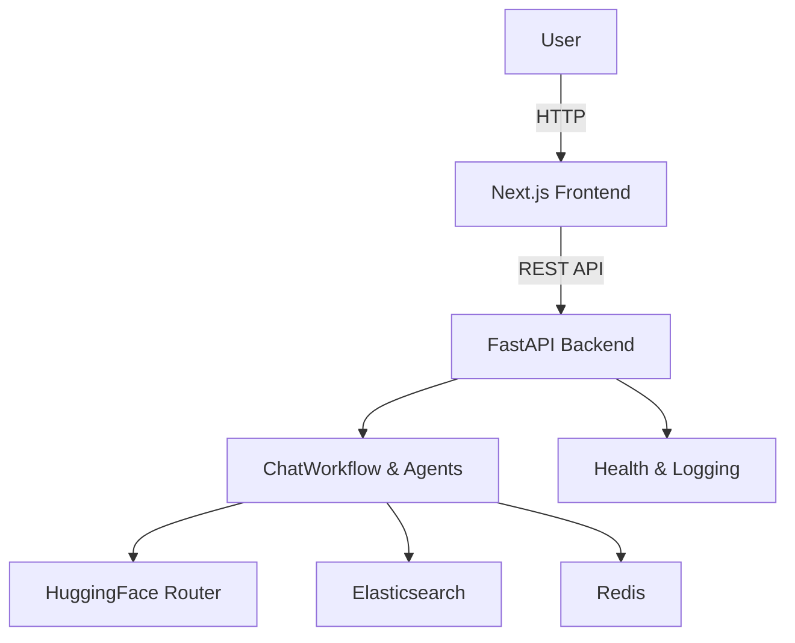

# AgenticAI

- One-line summary: Multi-agent RAG starter app with FastAPI backend, Redis memory, Elasticsearch retrieval, and a minimal Next.js frontend.
- Short project overview: AgenticAI provides a backend scaffold for ingesting PDF/CSV content, indexing it into Elasticsearch, and answering authenticated chat requests through coordinated agents.
- Main objective: Offer a maintainable developer-focused foundation for building a retrieval-enhanced conversational assistant.

# Features

- Auth
  - Email/password registration and login
  - JWT bearer token authentication

- Ingestion
  - CSV row ingestion from file or sample dataset
  - PDF page extraction per document page
  - Directory batch ingest for CSV and PDF files

- Agent workflow
  - SupervisorAgent routes requests to greeting, search, summary, or parallel flows
  - SearchAgent queries Elasticsearch and formats results
  - SummaryAgent generates summaries with LLM prompts
  - ChatWorkflow orchestrates memory, routing, and caching

- Services
  - Redis-backed conversation memory with in-memory fallback
  - Elasticsearch indexing and multi-match search
  - HuggingFace Router OpenAI-compatible LLM client

- Observability
  - Contextual logging with structured metadata
  - Optional Langfuse-style decorator support

# Architecture Overview

- Frontend: minimal Next.js app calling backend APIs.
- Backend: FastAPI app with routers, middleware, services, and workflows.
- Agent workflow: SupervisorAgent decides route, SearchAgent/SummaryAgent execute, ChatWorkflow builds the response.
- Retrieval pipeline: ingest CSV/PDF into Elasticsearch, then search title/snippet/category fields.


# Tech Stack

- Backend: Python 3.9, FastAPI, pydantic
- LLM Client: openai (HuggingFace Router OpenAI-compatible API)
- Search: elasticsearch Python client
- Memory: redis
- Observability: langfuse-compatible decorators, custom logging
- Frontend: TypeScript, Next.js

# Project Structure

```
AgenticAI/
├─ backend/
│  ├─ app/
│  │  ├─ agents/                # Agents: supervisor, search, summary
│  │  ├─ config/                # Settings
│  │  ├─ data_ingest/           # CSV/PDF ingestion pipelines
│  │  ├─ middleware/            # Logging, rate-limiting, headers
│  │  ├─ memory/                # Redis memory service
│  │  ├─ models/                # Pydantic models
│  │  ├─ prompts/               # LLMPrompts templates
│  │  ├─ routers/               # FastAPI routers (auth, ingest, chat, health)
│  │  ├─ services/              # LLM, search, auth, token services
│  │  ├─ state/                 # GraphState dataclass
│  │  ├─ workflows/             # ChatWorkflow orchestrator
│  │  ├─ logging_config.py      # Logging & formatting
│  │  └─ main.py                # FastAPI app entrypoint
│  ├─ requirements.txt
│  └─ .env

├─ frontend/
│  ├─ app/                     # Next.js app (layout.tsx, page.tsx)
│  └─ package.json

├─ podman-compose.yml
```

# System Workflow

- User request arrives at frontend and is forwarded to backend chat API.
- ChatWorkflow generates or reuses a conversation ID, checks cache, and stores user input.
- SupervisorAgent selects a route using LLM or fallback keyword routing.
- SearchAgent runs Elasticsearch retrieval when required.
- SummaryAgent generates text using configured LLM prompts.
- In parallel mode, search and summary run together and may produce a grounded answer.
- The final response is stored in memory and cached.

# Agent Architecture

- SupervisorAgent: decides between greeting, search, summary, or parallel routes.
- SearchAgent: performs Elasticsearch search and returns formatted results.
- SummaryAgent: summarizes user input and conversation context via LLM.
- ChatWorkflow: coordinates memory, routing, agents, and response assembly.

# Retrieval Pipeline

- CSV ingestion: `load_documents_from_csv` reads CSV rows into documents with title, snippet, category, and source.
- PDF ingestion: `load_documents_from_pdf` extracts text from each PDF page and produces document records.
- Elasticsearch indexing: `SearchService.bulk_index_documents` creates the index mapping if needed and bulk indexes data.
- Search process: `SearchService.search` runs a multi-match query over `title^2`, `snippet`, and `category`.

# API Overview

- Auth: `/api/v1/auth/register`, `/api/v1/auth/login`
- Chat: `/api/v1/chat`, `/api/v1/conversations/{conversation_id}/context` (GET, DELETE)
- Ingest: `/api/v1/ingest/sample-data`, `/api/v1/ingest/upload`, `/api/v1/ingest/batch`
- Health: `/health`

# Configuration

- `HUGGINGFACE_API_KEY`: HuggingFace Router API key for LLM calls.
- `ELASTICSEARCH_URL`, `ELASTICSEARCH_INDEX`: Elasticsearch endpoint and index name.
- `REDIS_URL`: Redis connection for memory and auth storage.
- `AUTH_SECRET_KEY`, `AUTH_ALGORITHM`, `AUTH_TOKEN_EXPIRY_MINUTES`: JWT authentication settings.
- `LANGFUSE_ENABLED`, `LANGFUSE_HOST`, `LANGFUSE_PUBLIC_KEY`, `LANGFUSE_SECRET_KEY`: optional tracing configuration.
- `BACKEND_CORS_ORIGINS`: allowed CORS origins.

# Installation

Backend:

```bash
cd backend
python3 -m venv .venv
source .venv/bin/activate
pip install -r requirements.txt
uvicorn app.main:app --reload --host 0.0.0.0 --port 8000
```

Frontend:

```bash
cd frontend
npm install
npm run dev
```

# Usage

Example API calls:

```bash
curl -X POST http://localhost:8000/api/v1/auth/register -H 'Content-Type: application/json' -d '{"email":"me@local","password":"pass123"}'
```

```bash
curl -X POST http://localhost:8000/api/v1/auth/login -H 'Content-Type: application/json' -d '{"email":"me@local","password":"pass123"}'
```

```bash
curl -X POST http://localhost:8000/api/v1/chat -H 'Authorization: Bearer TOKEN' -H 'Content-Type: application/json' -d '{"message":"Summarize the product catalog"}'
```

Sample queries:

- "Summarize the product catalog"
- "Show me documents about embeddings"
- "What is the best tool for observability?"

# Error Handling & Observability

- Logging: custom root logger with context fields and optional JSON output.
- Tracing: optional Langfuse-compatible decorator support if enabled.
- Health endpoint reports Redis and Elasticsearch availability.

# Development Guide

- Add an agent: create a new class in `backend/app/agents/`, implement `run(state: GraphState)`, and use it in `ChatWorkflow`.
- Add an endpoint: create a router in `backend/app/routers/`, define Pydantic models, and include the router in `backend/app/main.py`.
- Extend ingestion: add loader logic under `backend/app/data_ingest/`, and update file handling in `file_ingest.py`.

# Conclusion

AgenticAI is a compact, developer-focused FastAPI scaffold for authenticated chat, PDF/CSV ingestion, Elasticsearch retrieval, and LLM-driven agent workflows.
